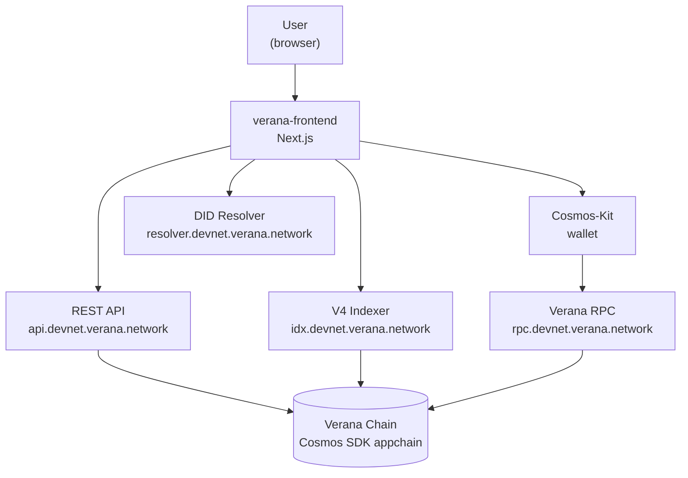
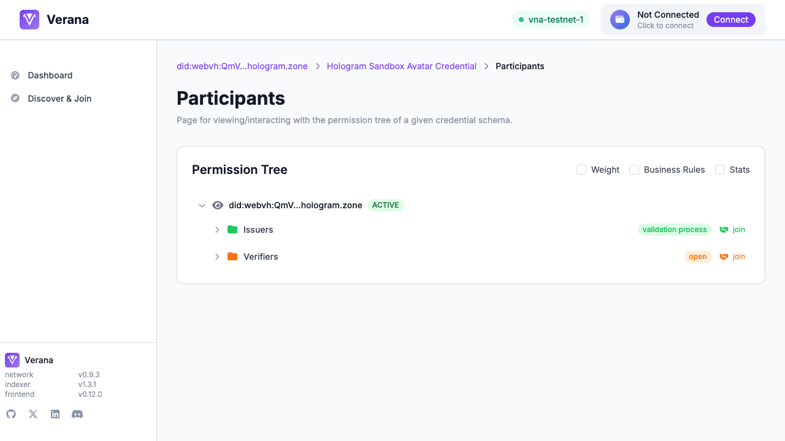

<div align="center">
  

  <h2>Verana Frontend</h2>

  <p>Verana dashboard for managing and joining digital trust ecosystems.</p>

  <a href="https://nodejs.org/en"></a>
  <a href="https://nextjs.org/"></a>
  <a href="https://www.typescriptlang.org/"></a>
  <a href="https://tailwindcss.com/"></a>
  <a href="#docker"></a>
  <a href="#helm"></a>
  <a href="LICENSE"></a>
  <a href="https://github.com/verana-labs/verana-frontend/actions/workflows/ci.yml"></a>
  <a href="https://discord.gg/edjaFn252q"></a>

  <br/><br/>

  <a href="https://app.devnet.verana.network/dashboard"><b>Try the devnet app →</b></a>
</div>

<div align="center">
  
</div>

---

### What is this?

Verana is an open initiative building a decentralized trust layer for the internet with DIDs, verifiable credentials, governed ecosystems, and public trust resolution. The Verana network is a Cosmos SDK Layer 1 appchain that acts as a Verifiable Public Registry. Learn more at [docs.verana.io](https://docs.verana.io/).

This repo is the web dashboard where participants connect a wallet and act on the network: create ecosystems, define credential schemas, manage participant roles, join ecosystems through onboarding processes, and store digests. Looking for the read-only explorer instead? See [verana-visualizer](https://github.com/verana-labs/verana-visualizer) (live at [vis.devnet.verana.network](https://vis.devnet.verana.network)).

---

### Table of contents

- [Architecture](#architecture)
- [Features](#features)
- [Tech stack](#tech-stack)
- [Quick start](#quick-start)
- [Configuration](#configuration)
- [Docker](#docker)
- [Kubernetes](#kubernetes)
- [Helm](#helm)
- [Project structure](#project-structure)
- [Roadmap](#roadmap)
- [Contributing](#contributing)
- [License and community](#license-and-community)

---

### Architecture



Queries use the strict V4 indexer contracts for ecosystems, credential schemas, participants, corporations, digests, trust deposits, metrics, and websocket block events. Writes go through Cosmos-Kit, which signs and broadcasts to the chain RPC. DID resolution goes through the universal resolver.

---

### Features

- Wallet connect via Cosmos-Kit (Keplr, Leap, WalletConnect)
- Browse ecosystems and credential schemas
- Participant tree with active, inactive, repaid, slashed, and future states
- Create corporations, authorize operators, and create ecosystems
- Create, adjust, revoke, and validate issuer, verifier, grantor, and holder participants
- Join ecosystems through onboarding processes
- Track pending participant onboarding tasks
- Store and resolve digests through the DI module
- Trust deposit and topup flows
- Live updates via the indexer websocket
- Light and dark theme, responsive layout, basic i18n surface

<div align="center">
  
</div>

A few of the main screens:

<table>
<tr>
<td align="center"><br/><sub>Ecosystem detail</sub></td>
<td align="center"><br/><sub>Credential schema</sub></td>
</tr>
<tr>
<td align="center" colspan="2"><br/><sub>Participant tree</sub></td>
</tr>
</table>

---

### Tech stack

- Next.js + React
- TypeScript
- Cosmos ecosystem integrations
- NextAuth authentication

---

### Quick start

Prerequisites:

- Node.js 22+
- Corepack enabled (ships with Node)

```bash
git clone https://github.com/verana-labs/verana-frontend.git
cd verana-frontend
corepack enable
pnpm install
pnpm dev
```

Open http://localhost:3000

The repo ships an `.env` with `vna-devnet-1` and live V4 indexer defaults. To point at a different chain or environment, override the relevant `NEXT_PUBLIC_VERANA_*` variables in `.env.local`.

---

### Configuration

Public runtime variables. Source of truth is `.env` at the repo root.

**Chain identity**

| Variable | Description | Example |
| --- | --- | --- |
| `NEXT_PUBLIC_VERANA_CHAIN_ID` | Cosmos chain ID | `vna-devnet-1` |
| `NEXT_PUBLIC_VERANA_CHAIN_NAME` | Display name | `VeranaDevnet1` |

**RPC and REST endpoints**

| Variable | Description | Example |
| --- | --- | --- |
| `NEXT_PUBLIC_VERANA_RPC_ENDPOINT` | CometBFT RPC | `https://rpc.devnet.verana.network` |
| `NEXT_PUBLIC_VERANA_REST_ENDPOINT` | Verana REST API | `https://api.devnet.verana.network` |
| `NEXT_PUBLIC_VERANA_REST_ENDPOINT_ECOSYSTEM` | V4 ecosystem indexer | `https://idx.devnet.verana.network/v4/ecosystem` |
| `NEXT_PUBLIC_VERANA_REST_ENDPOINT_CREDENTIAL_SCHEMA` | V4 credential schema indexer | `https://idx.devnet.verana.network/v4/credential-schema` |
| `NEXT_PUBLIC_VERANA_REST_ENDPOINT_PARTICIPANT` | V4 participant indexer | `https://idx.devnet.verana.network/v4/participant` |
| `NEXT_PUBLIC_VERANA_REST_ENDPOINT_DIGEST` | V4 digest indexer | `https://idx.devnet.verana.network/v4/di` |
| `NEXT_PUBLIC_VERANA_REST_ENDPOINT_TRUST_DEPOSIT` | V4 trust deposit indexer | `https://idx.devnet.verana.network/v4/trust-deposit` |
| `NEXT_PUBLIC_VERANA_REST_ENDPOINT_CORPORATION` | V4 corporation indexer | `https://idx.devnet.verana.network/v4/corporation` |
| `NEXT_PUBLIC_VERANA_REST_ENDPOINT_DELEGATION` | V4 delegation indexer | `https://idx.devnet.verana.network/v4/delegation` |
| `NEXT_PUBLIC_VERANA_REST_ENDPOINT_GOVERNANCE_FRAMEWORK` | V4 governance framework indexer | `https://idx.devnet.verana.network/v4/governance-framework` |
| `NEXT_PUBLIC_VERANA_REST_ENDPOINT_INDEXER` | V4 indexer status | `https://idx.devnet.verana.network/v4/indexer` |
| `NEXT_PUBLIC_VERANA_REST_ENDPOINT_METRICS` | V4 metrics | `https://idx.devnet.verana.network/v4/metrics` |
| `NEXT_PUBLIC_VERANA_REST_ENDPOINT_RESOLVER` | DID resolver | `https://resolver.devnet.verana.network/v1` |
| `NEXT_PUBLIC_VERANA_WEBSOCKET` | V4 indexer subscription | `wss://idx.devnet.verana.network/v4/indexer/subscribe` |

**Wallet provider (WalletConnect and Cosmos-Kit)**

| Variable | Description | Example |
| --- | --- | --- |
| `NEXT_PUBLIC_VERANA_CHAIN_PROVIDER_PROJECT_ID` | WalletConnect project ID | `e09f8de2a0b30d2e2ee9d061afb2667b` |
| `NEXT_PUBLIC_VERANA_CHAIN_PROVIDER_RELAY_URL` | WalletConnect relay | `wss://relay.walletconnect.org` |
| `NEXT_PUBLIC_VERANA_CHAIN_PROVIDER_METADATA_NAME` | App name shown in wallet | `Verana` |
| `NEXT_PUBLIC_VERANA_CHAIN_PROVIDER_METADATA_DESCRIPTION` | App description | `Verana dashboard for managing and joining digital trust Ecosystems` |
| `NEXT_PUBLIC_VERANA_CHAIN_PROVIDER_METADATA_URL` | App URL | `https://verana.io` |
| `NEXT_PUBLIC_VERANA_CHAIN_PROVIDER_METADATA_ICONS` | App icons | `https://verana.io/logo.svg` |

**Runtime tuning**

| Variable | Description | Example |
| --- | --- | --- |
| `NEXT_PUBLIC_VERANA_SIGN_DIRECT_MODE` | Use Direct signing | `true` |
| `NEXT_PUBLIC_SESSION_LIFETIME_SECONDS` | Auth session lifetime | `86400` |
| `NEXT_PUBLIC_LOW_BALANCE_WARN_UVNA` | Low balance warning threshold in uvna | `1000000` |

**External links**

| Variable | Description | Example |
| --- | --- | --- |
| `NEXT_PUBLIC_VERANA_EXPLORER_URL` | Block explorer | `https://explorer.devnet.verana.network/Verana%20Devnet` |
| `NEXT_PUBLIC_VERANA_VISUALIZER_URL` | Sister visualizer | `https://vis.devnet.verana.network` |
| `NEXT_PUBLIC_VERANA_TOPUP_VS` | Faucet/topup verifiable service | `did:web:faucet-vs.devnet.verana.network` |

All `NEXT_PUBLIC_*` values are exposed to the client by design (standard Next.js behavior). Override per environment via `.env.local` or container env vars.

---

### Docker

The app ships as a single container, multi-stage build on `node:22-alpine`.

Build:

```bash
docker build -t verana/verana-frontend:local .
```

Run (override the relevant env vars for your chain):

```bash
docker run --rm -p 3000:3000 \
  -e NEXT_PUBLIC_VERANA_CHAIN_ID=vna-devnet-1 \
  -e NEXT_PUBLIC_VERANA_CHAIN_NAME=VeranaDevnet1 \
  -e NEXT_PUBLIC_VERANA_RPC_ENDPOINT=https://rpc.devnet.verana.network \
  -e NEXT_PUBLIC_VERANA_REST_ENDPOINT=https://api.devnet.verana.network \
  verana/verana-frontend:local
```

Compose files in `docker-compose/` cover dev (`docker-dev`, `docker-dev-no-environment`) and hub-pulled (`docker-hub`, `docker-hub-no-environment`).

---

### Kubernetes

Apply the provided manifest:

```bash
kubectl apply -f kubernetes/verana-frontend-deployment.yaml
```

Edit env vars under `spec.template.spec.containers[0].env` for your chain.

---

### Helm

Chart at `charts/`. Install:

```bash
helm install verana-frontend ./charts \
  --set image.repository=verana/verana-frontend \
  --set image.tag=latest
```

Common overrides (see [charts/README.md](charts/README.md) for the full values reference):

- `replicas` (default 1)
- `service.type` (default ClusterIP)
- `env.NEXT_PUBLIC_VERANA_*` (override per environment)

---

### Project structure

```
app/
├─ dashboard/         # Overview and entry KPIs
├─ ecosystems/        # Ecosystem list, detail, and creation
├─ credential-schemas/# Credential schema detail and creation
├─ participants/      # Participant tree per credential schema
│  └─ [id]/
├─ pendingtasks/      # Onboarding processes you participate in
├─ discover/          # Ecosystem discovery
├─ digests/           # DI digest storage and lookup
├─ join/[id]/         # Ecosystem join flow
├─ tr/                # Narrow redirects for retired URLs
├─ account/           # Connected wallet, balance, low-balance warn
├─ api/sri/           # Internal API route
├─ msg/               # Cosmos msg builders and tx flows
├─ providers/         # React context providers (chain, wallet, indexer events)
├─ hooks/             # Data hooks (queries, indexer subscriptions)
├─ ui/                # Reusable UI primitives (data view, data table, common)
├─ lib/               # logger, env helpers
├─ util/              # cross-cutting utils
├─ i18n/              # i18n surface
├─ types/             # TypeScript types
└─ styles/            # Tailwind and globals
```

Plus top-level: `charts/`, `kubernetes/`, `docker-compose/`, `public/`, `Dockerfile`, `next.config.ts`, `biome.json`, `tsconfig.json`.

---

### Roadmap

Upcoming work is tracked in the [issues](https://github.com/verana-labs/verana-frontend/issues) and in the [verana-frontend-spec](https://verana-labs.github.io/verana-frontend-spec/) browsable spec. `CHANGELOG.md` is generated by release-please and reflects shipped versions.

---

### Contributing

1. Fork the repo
2. Create a branch with a conventional prefix (`feat/`, `fix/`, `chore/`, `docs/`)
3. Use conventional commits (`feat:`, `fix:`, `chore:`, `docs:`)
4. Open a PR with context, screenshots if the UI changes, and a link to the issue it closes
5. CI must pass: `check-format` and `check-types`

Spec: https://verana-labs.github.io/verana-frontend-spec/

---

### License and community

This project is licensed under Apache-2.0 (see `LICENSE`).

- Docs: https://docs.verana.io/
- GitHub: https://github.com/verana-labs
- Repo: https://github.com/verana-labs/verana-frontend
- Discord: https://discord.gg/edjaFn252q
- X: https://x.com/Verana_io

Don't trust. Verify.
